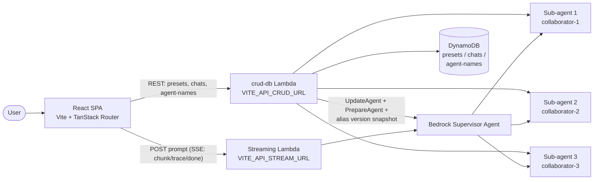

# MAGI — Trilateral Decision System

> Three independent cores deliberate every query. Compose, debate, and resolve prompts through the MAGI consensus protocol.

MAGI is a multi-agent chat app inspired by the decision system of the same name from *Neon Genesis Evangelion*. Every user prompt is forwarded to a supervisor AWS Bedrock Agent that fans the request out to three collaborator sub-agents (sub-agent 1, sub-agent 2, and sub-agent 3), each running its own foundation model and system prompt. The supervisor streams a single synthesized answer back to the browser while the UI simultaneously surfaces each sub-agent's chain-of-thought as it arrives.

The frontend is a Vite + React 19 SPA. The backend is a single Node.js Lambda (`crud-db`) that persists presets / chats / display names in DynamoDB and asynchronously rebuilds the Bedrock agents whenever a new configuration is applied.

Built for **CloudHacks 2026** by Kenneth Yandell, Brian Lien, and Timmy Phan.

---

## Features

- **Flow-canvas configuration** — Click any of the three nodes in the MAGI triangle to edit that sub-agent's display name, Bedrock foundation model, and system prompt. Implemented in [src/components/configure/flow-canvas.tsx](src/components/configure/flow-canvas.tsx) and [src/components/configure/subagent-form.tsx](src/components/configure/subagent-form.tsx).
- **Preset library** — Nine built-in councils (General, Code, Product, Science, Gaming, Writing, Culinary, Logic, Algorithms) plus user-saved presets. See [src/components/configure/preset-manager.tsx](src/components/configure/preset-manager.tsx) and the default catalogue in [src/api/default-presets.ts](src/api/default-presets.ts).
- **Asynchronous agent rebuild** — Applying a preset kicks off a ~12-minute Bedrock `UpdateAgent` → `PrepareAgent` → version-snapshot → alias-swap sequence in [backend/lambda/crud-db/index.mjs](backend/lambda/crud-db/index.mjs), while a loading dialog polls `/presets/status` until the agents are `ready` or `failed` ([src/components/configure/agent-loading-dialog.tsx](src/components/configure/agent-loading-dialog.tsx)).
- **Streaming chat with live sub-agent thoughts** — The chat page renders the supervisor response token-by-token in the centre panel while the right sidebar shows each collaborator's reasoning as Bedrock emits `orchestrationTrace` events. See [src/routes/_app/chat.tsx](src/routes/_app/chat.tsx) and [src/components/chat/chat-sidebars.tsx](src/components/chat/chat-sidebars.tsx).
- **Markdown + KaTeX rendering** — Supervisor replies support `$...$` / `$$...$$` math. `react-markdown` + `remark-math` + `rehype-katex` are wired up in [src/components/chat/chat-window.tsx](src/components/chat/chat-window.tsx); [src/utils/latex.ts](src/utils/latex.ts) normalizes the various delimiter styles models emit.
- **Persistent chat history** — Conversations are saved to DynamoDB keyed by `userId` + `chatId` and restored from the chat sidebar.
- **Renameable agents** — Display names live in a React context ([src/utils/agent-names-context.tsx](src/utils/agent-names-context.tsx)) and are written through to a DynamoDB sentinel row so they survive cold boots.
- **Terminal-green MAGI aesthetic** — Custom ASCII wordmark ([src/utils/ascii-block.ts](src/utils/ascii-block.ts)), terminal primitives ([src/components/magi/terminal.tsx](src/components/magi/terminal.tsx)), and a mono-only theme ([src/index.css](src/index.css)).

---

## Architecture



Two independent data paths:

1. **Chat path** — The SPA `POST`s `{ prompt, sessionId }` to the streaming Lambda Function URL and reads Server-Sent Events (`chunk`, `trace`, `done`, `error`). See [src/utils/magiStream.ts](src/utils/magiStream.ts). Trace events with a `collaboratorName` are mapped to flow-canvas nodes and pushed into the Subagent Thoughts sidebar.
2. **Control path** — The SPA hits the `crud-db` Lambda for all CRUD. Saving a preset returns immediately; the Lambda self-invokes asynchronously to run the Bedrock rebuild so the HTTP request never blocks for ten minutes.

---

## Tech stack

**Frontend** ([package.json](package.json))

- React 19 + TypeScript
- Vite 8
- TanStack Router (file-based routes, `autoCodeSplitting`)
- Tailwind CSS 4 + shadcn/ui + `tw-animate-css`
- `radix-ui`, `lucide-react`, `react-icons`
- `react-markdown` + `remark-math` + `rehype-katex` + `katex`
- `@fontsource-variable/geist`
- ESLint 9 with `typescript-eslint`, `eslint-plugin-react-hooks`, `eslint-plugin-react-refresh`

**Backend** ([backend/lambda/crud-db/package.json](backend/lambda/crud-db/package.json))

- Node.js ESM Lambda
- AWS SDK v3: `@aws-sdk/client-bedrock-agent`, `@aws-sdk/client-dynamodb`, `@aws-sdk/lib-dynamodb`, `@aws-sdk/client-lambda`

---

## Repository layout

```
.
├── README.md
├── index.html                  # Vite entry HTML
├── package.json                # Frontend deps + scripts
├── vite.config.ts              # Tailwind, TanStack Router, @ → src alias
├── components.json             # shadcn config
├── eslint.config.js
├── tsconfig*.json
├── public/                     # Static assets (favicon, icons)
├── src/
│   ├── main.tsx                # Mounts <RouterProvider/>
│   ├── routeTree.gen.ts        # Generated by @tanstack/router-plugin
│   ├── index.css               # Tailwind + theme tokens + MAGI palette
│   ├── routes/
│   │   ├── __root.tsx          # Wraps app in AgentNamesProvider
│   │   ├── index.tsx           # Landing page (ASCII wordmark, CTA)
│   │   ├── _app.tsx            # Authenticated layout (top nav + <Outlet/>)
│   │   └── _app/
│   │       ├── configure.tsx   # Flow canvas + preset manager + subagent form
│   │       └── chat.tsx        # Streaming chat + sub-agent thoughts
│   ├── components/
│   │   ├── top-nav.tsx
│   │   ├── chat/               # chat-window, chat-sidebars
│   │   ├── configure/          # flow-canvas, subagent-form, preset-manager,
│   │   │                       # models, agent-loading-dialog, sidebar-context
│   │   ├── magi/               # terminal.tsx: BootLine / CornerBracket / MagiBadge
│   │   └── ui/                 # shadcn primitives (button, dialog, select, ...)
│   ├── api/
│   │   ├── presets.ts          # Local-storage fallback + Preset type
│   │   └── default-presets.ts  # Nine built-in councils
│   ├── utils/
│   │   ├── api.ts              # fetch() wrappers for the crud-db Lambda
│   │   ├── magiStream.ts       # SSE client for the streaming Lambda
│   │   ├── agent-names-context.tsx
│   │   ├── use-agent-names.ts
│   │   ├── latex.ts            # Normalize \(..\) / \[..\] → $..$ / $$..$$
│   │   └── ascii-block.ts      # 5-row glyph grid for MAGI wordmarks
│   ├── lib/                    # cn(), constants
│   └── assets/                 # hero.png, react.svg, vite.svg
└── backend/
    ├── lambda/crud-db/
    │   ├── index.mjs           # Lambda handler (CRUD + async Bedrock rebuild)
    │   └── package.json
    └── crud-db-function.zip    # Pre-packaged deployment artifact
```

---

## Getting started

### Prerequisites

- Node.js 20+ and npm
- Two deployed Lambda endpoints (see [Backend](#backend-crud-db-lambda) for what each one does). For local UI-only development you can point these at any mock, but real responses require an AWS account with Bedrock Agents and a prepared Supervisor + 3 collaborators.

### Install + run

```bash
npm install
```

Create a `.env` file at the repo root:

```
VITE_API_STREAM_URL=https://<your-streaming-lambda-function-url>/
VITE_API_CRUD_URL=https://<your-crud-api-gateway-url>/
```

> `VITE_API_CRUD_URL` is concatenated directly with path segments like `presets`, `chats`, and `agent-names` in [src/utils/api.ts](src/utils/api.ts), so **it must end with a trailing `/`**.

Then:

```bash
npm run dev        # start Vite dev server on http://localhost:5173
npm run build      # type-check + production build to dist/
npm run lint       # ESLint
npm run preview    # serve the production build locally
```

---

## Frontend API contract

### Streaming supervisor — `VITE_API_STREAM_URL`

`POST` with JSON body `{ prompt, sessionId }`. Response is Server-Sent Events; each line begins with `data: ` and contains a JSON payload tagged with one of:

| `type`   | Payload              | Meaning                                                     |
| -------- | -------------------- | ----------------------------------------------------------- |
| `chunk`  | `{ text }`           | Next token(s) of the supervisor's answer.                   |
| `trace`  | `{ trace }`          | Raw Bedrock `TracePart`. Contains `collaboratorName` and `orchestrationTrace` for sub-agent reasoning. |
| `done`   | _(none)_             | Stream finished successfully.                               |
| `error`  | `{ message }`        | Fatal error.                                                |

Parsing lives in [src/utils/magiStream.ts](src/utils/magiStream.ts). Collaborator mapping (`collaborator-1` → sub-agent 1, `-2` → sub-agent 2, `-3` → sub-agent 3) happens in [src/routes/_app/chat.tsx](src/routes/_app/chat.tsx).

### CRUD — `VITE_API_CRUD_URL`

Wrapped by [src/utils/api.ts](src/utils/api.ts):

| Method   | Path                          | Body / query                                             | Purpose                                   |
| -------- | ----------------------------- | -------------------------------------------------------- | ----------------------------------------- |
| `GET`    | `presets`                     | —                                                        | List saved presets.                       |
| `POST`   | `presets`                     | `{ userId, name, melchior, balthasar, casper, supervisor }` | Save a preset + trigger Bedrock rebuild. |
| `DELETE` | `presets`                     | `{ userId, presetId }`                                   | Delete a preset.                          |
| `GET`    | `presets/status?userId=…`     | —                                                        | `"updating"` / `"ready"` / `"failed"`.    |
| `GET`    | `chats`                       | —                                                        | List a user's chat history.               |
| `POST`   | `chats`                       | `{ userId, chatId?, title, messages, presetUsed? }`      | Save / update a chat.                     |
| `GET`    | `agent-names?userId=…`        | —                                                        | Read the display-name sentinel row.       |
| `POST`   | `agent-names`                 | `{ userId, agentKey, name }`                             | Upsert a single agent's display name.     |

---

## Backend (`crud-db` Lambda)

Source: [backend/lambda/crud-db/index.mjs](backend/lambda/crud-db/index.mjs). Pre-built deployment artifact: [backend/crud-db-function.zip](backend/crud-db-function.zip).

**Responsibilities**

1. CRUD for presets, chats, and the agent-names sentinel row in DynamoDB.
2. On `POST /presets`: save the preset, mirror the new names into the sentinel row, then asynchronously self-invoke to rebuild Bedrock agents.
3. **Rebuild flow** — For each of the three sub-agents (in parallel) and then the Supervisor:
   - `UpdateAgent` with the new instruction + model.
   - `PrepareAgent` and poll until `PREPARED`.
   - Snapshot `DRAFT` to a new numbered version by creating a throwaway `CreateAgentAlias` (AWS creates a version as a side effect), then `UpdateAgentAlias` on the live alias to that version, then `DeleteAgentAlias` the throwaway. This keeps the supervisor's collaborator ARNs stable.
4. Write `updateStatus` back to DynamoDB as `"ready"` or `"failed"` when done.

**Required Lambda environment variables** (see the file header for the full list):

- Per agent (`MELCHIOR_`, `BALTHASAR_`, `CASPER_`, `SUPERVISOR_`): `AGENT_ID`, `AGENT_NAME`, `AGENT_ROLE_ARN`, `ALIAS_ID`
- `SUPERVISOR_AGENT_MODEL` — foundation model ID for the supervisor (sub-agent models come from the preset itself)

**Required IAM permissions**

- `bedrock:UpdateAgent`, `bedrock:PrepareAgent`, `bedrock:GetAgent`
- `bedrock:GetAgentAlias`, `bedrock:UpdateAgentAlias`, `bedrock:CreateAgentAlias`, `bedrock:DeleteAgentAlias`
- `lambda:InvokeFunction` on itself (for the async rebuild fanout)
- `dynamodb:PutItem`, `dynamodb:Query`, `dynamodb:DeleteItem`, `dynamodb:UpdateItem`, `dynamodb:GetItem`

**Lambda timeout:** at least **12 minutes** — the rebuild polls four Bedrock agents through `PREPARING` → `PREPARED`.

---

## Supported Bedrock models

Defined in [src/components/configure/models.tsx](src/components/configure/models.tsx). The configure UI restricts each sub-agent to one of:

- **Anthropic** — Claude 3.5 Sonnet v2, Claude 3.5 Haiku, Claude 3 Opus
- **Amazon** — Nova Pro, Nova Lite, Nova Micro, Titan Premier
- **Mistral** — Mistral Large 2
- **Cohere** — Command R+

## Prompt validation

Bedrock's `UpdateAgent` rejects instructions shorter than 40 characters, so the frontend enforces the same minimum via `MIN_PROMPT_LENGTH = 40` in [src/components/configure/models.tsx](src/components/configure/models.tsx). `isValidPrompt()` is used by [src/components/configure/subagent-form.tsx](src/components/configure/subagent-form.tsx) to gate the save button, and the backend re-validates before calling Bedrock.

---

## Authors

- Kenneth Yandell
- Brian Lien
- Timmy Phan

Built at **CloudHacks 2026**.
